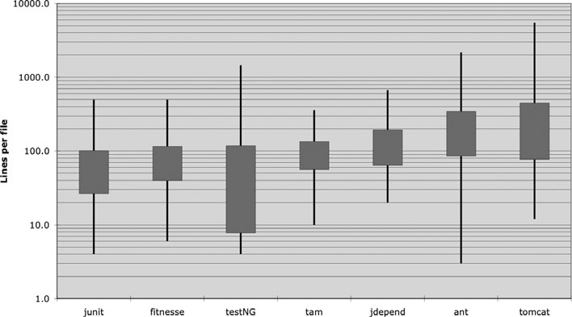
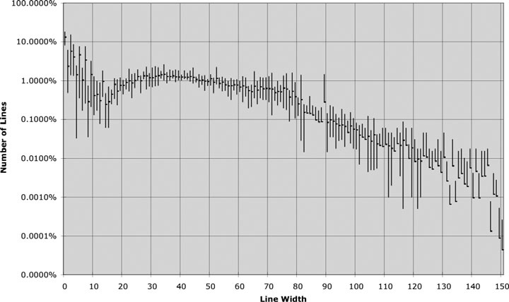
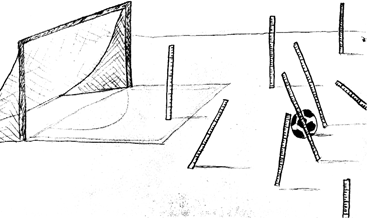

# 5 Formatting


<div dir='rtl'>

هنگامی‌که دیگران شروع می‌کنند به بررسی زیر و بم کد، می‌خواهیم آن‌ها را تحت تأثیر منظم بودن ، قوام و توجه به جزئیاتی که درک می‌کنند تحت تأثیر قرار دهیم. می‌خواهیم با نظم تحت‌تاثیر قرارگیرند. وقتی‌که به ماژول‌ها دقت می‌کنند، ابروهایشان بالا رود. می‌خواهیم بفهمند که افراد حرفه‌ای پشت کار بوده‌اند. اگر در عوض، توده کدی بینند که گویی توسط تعدادی ملوان مست نوشته شده‌است، به احتمال زیاد نتیجه می‌گیرند که همین عدم توجه به جزئیات، بر دیگر جنبه‌های پروژه نیز حاکم است.

باید مراقب باشید که کد شما به خوبی قالب‌بندی شود. باید مجموعه‌ای از قوانین ساده را انتخاب کنید که بر فرمت کد شما حاکم باشد، و سپس باید آن قوانین را به طور مداوم اعمال کنید. اگر در یک تیم کار می‌کنید ، تیم باید با یک مجموعه از قوانین قالب‌بندی موافقت کند و همه اعضا، آن را رعایت کنند. داشتن ابزاری خودکار که بتواند آن قوانین قالب‌بندی را برای شما اعمال کند، می‌تواند کمک‌کننده باشد.

## هدف قالب‌بندی

اول از همه، بگذارید واضح باشیم. قالب‌بندی کد مهم است. بسیار مهم است که نادیده گرفته‌نشود و بسیار مهم است که مثل یک رفتار مذهبی به آن اهمیت دهید. قالب‌بندی کد مربوط به ارتباطات است و ارتباطات، مهمترین بخش برای توسعه‌دهندگان حرفه‌ای است.

شاید فکر کرده باشید که "به نتیجه رساندن" مهمترین بخش برای یک توسعه‌دهنده حرفه‌ای است. با این حال امیدوارم تاکنون این کتاب شما را از این ایده خارج کرده‌باشد. عملکردی که امروز ایجاد می کنید شانس زیادی برای تغییر در نسخه بعدی دارد ، اما خوانایی کد شما تأثیر عمیقی در تمام تغییراتی خواهد داشت که ایجاد می‌شود. شیوه کد نویسی و خوانایی مواردی را ایجاد می کند که مدت ها بعد از تغییر کد اصلی، بر حفظ و توسعه آن تأثیر می گذارد. سبک و نظم شما زنده می ماند ، حتی اگر کد شما اینگونه نباشد.

بنابراین چه موارد قالب‌بندی به ما کمک می‌کند تا بهترین ارتباط را برقرار کنیم؟

## قالب بندی عمودی

بیایید با اندازه عمودی شروع کنیم. یک فایل منبع چقدر باید بزرگ باشد؟ در جاوا ، اندازه فایل با اندازه کلاس ارتباط نزدیک دارد. وقتی در مورد کلاس صحبت کنیم ، درباره اندازه کلاس صحبت خواهیم کرد. در حال حاضر بگذارید فقط اندازه فایل را در نظر بگیریم.

بزرگترین فایل‌های منبع جاوا چقدر بزرگ هستند؟ به نظر می‌رسد که طیف وسیعی از اندازه‌ها و تفاوت‌های قابل توجه در سبک وجود دارد. شکل 5-1 برخی از این تفاوت‌ها را نشان می‌دهد.

هفت پروژه مختلف به تصویر کشیده شده است.Junit, FitNesse, testNG, Time and Money, JDepend, Ant, و Tomcat. خطوط موجود در کادرها حداقل و حداکثر طول فایل را در هر پروژه نشان می‌دهد. این کادر تقریباً یک سوم فایل‌ها (یک انحراف استاندارد) را نشان می دهد. وسط جعبه، میانگین است. بنابراین متوسط اندازه فایل در پروژه FitNesse حدود 65 خط است و حدود یک سوم پرونده ها بین 40 تا 100 خط است. بزرگترین فایل در FitNesse حدود 400 خط و کوچکترین آن 6 خط است. توجه داشته باشید که این مقیاس لگاریتمی است، بنابراین اختلاف کم در موقعیت عمودی نشانگر اختلاف بسیار بزرگ در اندازه مطلق است.
</div>



<div dir='rtl'>
توزیع طول فایل در مقیاس لگاریتمی (box height = sigma)

Junit ، FitNesse و Time and Money از فایل‌های نسبتاً کمی تشکیل شده اند. هیچکدام بیش از 500 خط نیستند و بیشتر این فایل‌ها کمتر از 200 خط هستند. از طرف دیگر ، Tomcat و Ant دارای برخی از فایل‌ها هستند که چندین هزار خط طول دارند و نزدیک به نیمی از آنها بیش از 200 خط هستند.

برای ما چه معنایی دارد؟ به نظر می‌رسد امکان ساخت سیستم های قابل توجهی وجود دارد (FitNesse نزدیک به 50000 خط است) از فایل‌هایی که معمولاً 200 خط طول دارند و حد بالایی آنها 500 است. اگرچه این یک قانون سخت و سریع نیست ، اما باید بسیار مورد توجه قرار گیرد که درک فایل‌های کوچک معمولاً آسانتر از فایل‌های بزرگ است.

### استعاره روزنامه

به یک مقاله خوش نوشت روزنامه فکر کنید. آن را به صورت عمودی می خوانید. در بالا، یک عنوان وجود دارد که به شما بگویید داستان از چه قرار است و به شما امکان می‌دهد تصمیم بگیرید که آیا مطلبی است که می خواهید بخوانید یا نه. پاراگراف اول خلاصه ای از کل داستان را به شما می دهد و تمام جزئیات را پنهان می کند. وقتی به سمت پایین ادامه می دهید ، جزئیات بیشتر می‌شوند، تا زمانی که همه تاریخ‌ها ، نام‌ها ، نقل قول‌ها ، ادعاها و سایر جزئیات را دارید.

دوست داریم که یک فایل منبع مانند مقاله روزنامه باشد. نام باید ساده، اما توضیحی باشد. این نام به خودی خود باید کافی باشد تا به ما بگوید آیا در ماژول درستی هستیم یا نه. بالاترین قسمت‌های فایل منبع باید مفاهیم و الگوریتم‌های سطح بالایی را ارائه دهند. با حرکت به سمت پایین جزئیات باید افزایش یابد تا اینکه در پایان، توابع و جزئیات پایین‌ترین سطح را در فایل منبع پیدا کنیم.

یک روزنامه از مقالات زیادی تشکیل شده است؛ بیشتر آنها بسیار کوچک هستند. بعضی از آنها کمی بزرگتر هستند. تعداد کمی از آنها درحد یک صفحه هستند. این باعث می شود روزنامه قابل استفاده باشد. اگر روزنامه فقط یک داستان طولانی بود که شامل مجموعه‌ای بی‌نظم از واقعیت‌ها‌، تاریخ‌ها و نام‌ها بود‌، به‌راحتی آن را نمی‌خواندیم.

### گشودگی عمودی بین مفاهیم

تقریباً همه کد‌ها از چپ به راست و بالا به پایین خوانده می‌شوند. هر سطر بیانگر یک عبارت یا بند است و هر گروه از خطوط بیانگر یک تفکر کامل است. این افکار را باید با خطوط خالی از یکدیگر جدا کرد.

برای مثال ، لیست 5-1 را در نظر بگیرید. خطوط خالی‌ای وجود دارد که تعریف پکیج ، import(ها) و هر یک از توابع را جدا می کند. این قانون بسیار ساده، تأثیر پیش‌بینی شده‌ای در طرح بصری کد دارد. هر خط خالی، یک نشانه بصری است که مفهوم جدید و جداگانه‌ای را مشخص می‌کند. هنگامی که لیست را اسکن می‌کنید ، چشمتان به اولین خطی می‌رود که بعد یک خط خالی آمده.

</div>

Listing 5-1

BoldWidget.java
```java
package fitnesse.wikitext.widgets;

import java.util.regex.*;

public class BoldWidget extends ParentWidget {
	public static final String REGEXP = "'''.+?'''";
	private static final Pattern pattern = Pattern.compile("'''(.+?)'''",
		Pattern.MULTILINE + Pattern.DOTALL
	);

	public BoldWidget(ParentWidget parent, String text) throws Exception {
		super(parent);
		Matcher match = pattern.matcher(text);
		match.find();
		addChildWidgets(match.group(1));
	}

	public String render() throws Exception {
		StringBuffer html = new StringBuffer("<b>");
		html.append(childHtml()).append("</b>");
		return html.toString();
	}
}
```
<div dir='rtl'>

حذف آن خطوط خالی، مانند لیست 5-2، تأثیر قابل ملاحظه ای در خوانایی کد دارد.

</div>

Listing 5-2

BoldWidget.java
```java
package fitnesse.wikitext.widgets;
import java.util.regex.*;
public class BoldWidget extends ParentWidget {
	public static final String REGEXP = "'''.+?'''";
	private static final Pattern pattern = Pattern.compile("'''(.+?)'''",
	Pattern.MULTILINE + Pattern.DOTALL);
	public BoldWidget(ParentWidget parent, String text) throws Exception {
		super(parent);
		Matcher match = pattern.matcher(text);
		match.find();
		addChildWidgets(match.group(1));
	}
	public String render() throws Exception {
		StringBuffer html = new StringBuffer("<b>");
		html.append(childHtml()).append("</b>");
		return html.toString();
	}
}
```
<div dir='rtl'>

هنگامی که چشم خود را متمرکز نکنید این اثر حتی بیشتر نمایان می شود. در مثال اول، گروه‌بنهدی‌های مختلف خطوط، واضح‌اند، درحالی‌که مثال دوم، به نظر می رسد درهم و برهم است. تفاوت این دو لیست درمقدار کمی از گشودگی عمودی است.

### تراکم عمودی

اگر گشودگی، مفاهیم را از هم جدا کند ، پس تراکم عمودی به معنای یک ارتباط نزدیک است. بنابراین خطوط کدی که کاملاً با هم مرتبط هستند، باید به صورت عمودی متراکم به نظر برسند. توجه کنید که چگونه کامنت‌های بی فایده در لیست 5-3 ارتباط نزدیک دو متغیر نمونه را از بین می‌برد.

</div>

Listing 5-3
```java
public class ReporterConfig {

	/**
	* The class name of the reporter listener
	*/
	private String m_className;
	
	/**
	* The properties of the reporter listener
	*/
	private List<Property> m_properties = new ArrayList<Property>();
	
	public void addProperty(Property property) {
		m_properties.add(property);
	}
}
```
<div dir='rtl'>

خواندن لیست 5-4 بسیار راحت‌تر است. این در یک "نگاه" قرار می‌گیرد ، یا حداقل برای من اینطور است. بدون اینکه خیلی سر یا چشمهایم را حرکت دهم، می توانم به آن نگاه کنم و ببینم که این یک کلاس با دو متغیر و یک تابع است. لیست قبلی من را مجبور می‌کند تا از حرکت چشم و سر بسیار بیشتری برای رسیدن به سطح درک مشابه استفاده کنم.

</div>

Listing 5-4
```java
public class ReporterConfig {
	private String m_className;
	private List<Property> m_properties = new ArrayList<Property>();
	public void addProperty(Property property) {
		m_properties.add(property);
	}
}
```
<div dir='rtl'>

### فاصله عمودی
تابحال شده که در کلاسی پرسه بزنید، از یک تابع به تابع دیگر بروید، سورس فایل را بالا و پایین کنید، ارتباط و عملکرد توابع را بفهمید اما نهایتا گیج شوید؟ آیا تابحال برای فهمیدن تعریف یک متغیر یا تابع به زنجیره‌ای از وراثت برخورد کرده‌اید؟ این ناامیدکننده است زیرا شما در حال فهمیدن این هستید که سیستم چه کاری انجام می دهد ، اما وقت و انرژی ذهنی خود را صرف این می کنید که مکانها را بیابید و به خاطر بسپارید.

مفاهیمی که ارتباط تنگاتنگی دارند باید به صورت عمودی نزدیک به یکدیگر نگه داشته شوند [G10]. واضح است که این قانون برای مفاهیمی که در فایل‌های جداگانه قرار دارند کار نمی کند. اما در این صورت مفاهیم نزدیک به هم را نباید در فایل‌های مختلف جدا کرد ، مگر اینکه دلیل خیلی خوبی داشته باشید. در واقع ، این یکی از دلایلی است که باید از متغیرهای محافظت شده اجتناب شود.

برای آن دسته از مفاهیمی که چنان با هم مرتبط هستند که در همان پرونده منبع قرار دارند ، تفکیک عمودی آنها باید معیاری برای میزان اهمیت هر یک برای قابل درک بودن دیگری باشد. می‌خواهیم از اجبار خوانندگان خود برای جستجوی فایل‌ها و کلاس‌های منبع جلوگیری کنیم.

**تعریف متغیر** متغیرها باید تا حد امکان نزدیک به کاربرد آنها تعریف شوند. از آنجا که توابع ما بسیار کوتاه هستند ، متغیرهای محلی باید در بالای هر تابع ظاهر شوند ، مانند این تابع longish از Junit4.3.1.

</div>

```java
private static void readPreferences() {
	InputStream is= null;
	try {
		is= new FileInputStream(getPreferencesFile());
		setPreferences(new Properties(getPreferences()));
		getPreferences().load(is);
	} catch (IOException e) {
		try {
			if (is != null)
			is.close();
		} catch (IOException e1) {
		}
	}
}
```
<div dir='rtl'>

متغیرهای کنترلی برای حلقه‌ها معمولاً باید در عبارت حلقه اعلان شوند ، همانطور که در این تابع کوچک زیبا از همان منبع وجود دارد.

</div>

```java
public int countTestCases() {
	int count= 0;
	for (Test each : tests)
	count += each.countTestCases();
	return count;
}
```
<div dir='rtl'>

در موارد نادر ، یک متغیر ممکن است در بالای یک بلوک یا درست قبل از حلقه در یک تابع طولانی اعلام شود. چنین متغیری را می توانید از وسط یک تابع بسیار طولانی در TestNG در این قطعه مشاهده کنید.

</div>

```java
...
for (XmlTest test : m_suite.getTests()) {
		TestRunner tr = m_runnerFactory.newTestRunner(this, test);
		tr.addListener(m_textReporter);
		m_testRunners.add(tr);
		invoker = tr.getInvoker();
		for (ITestNGMethod m : tr.getBeforeSuiteMethods()) {
			beforeSuiteMethods.put(m.getMethod(), m);
		}
		for (ITestNGMethod m : tr.getAfterSuiteMethods()) {
			afterSuiteMethods.put(m.getMethod(), m);
		}
}
...
```
<div dir='rtl'>

**متغیرهای نمونه** از طرف دیگر، باید در بالای کلاس اعلام شود. نباید فاصله عمودی این متغیرها را افزایش داد، زیرا در یک کلاس خوب طراحی شده، اگر نه همه ، بسیاری از متدهای کلاس از آنها استفاده می‌کنند.

بحث های زیادی در مورد اینکه متغیرهای نمونه باید به کجا بروند وجود داشته است. در C ++ معمولاً قانون به اصطلاح قیچی را اجرا می‌کنیم که همه متغیرهای نمونه را در پایین قرار می‌دهد. با این حال ، قرارداد رایج در جاوا این است که همه آن‌ها را در بالای کلاس قرار دهید. من دلیلی برای پیروی از هر قرارداد دیگری نمی‌بینم. نکته مهم این است که متغیرهای نمونه در یک مکان شناخته شده اعلام شوند. همه باید بدانند که برای دیدن تعاریف به کجا مراجعه کنند.

به عنوان مثال ، مورد عجیب کلاس TestSuite را در JUnit 4.3.1 در نظر بگیرید. من این کلاس را بسیار ضعیف کردم تا نکته را بیان کنم. اگر نگاهی به نیمه لیست بیندازید ، دو متغیر نمونه  در آنجا تعریف شده. پنهان‌کردن آن‌ها در مکان بهتر دشوار خواهد بود. شخصی که این کد را می خواند باید در تعریف‌ها تصادفی بلغزد (همانطور که من این کار را کردم).

</div>

```java
public class TestSuite implements Test {
	static public Test createTest(Class<? extends TestCase> theClass,
	String name) {
		...
	}
	public static Constructor<? extends TestCase>
	getTestConstructor(Class<? extends TestCase> theClass)
	throws NoSuchMethodException {
		...
	}
	public static Test warning(final String message) {
		...
	}
	private static String exceptionToString(Throwable t) {
		...
	}
	private String fName;
	private Vector<Test> fTests= new Vector<Test>(10);
	public TestSuite() {
	}
	public TestSuite(final Class<? extends TestCase> theClass) {
		...
	}
	public TestSuite(Class<? extends TestCase> theClass, String name) {
		...
	}
	... ... ... ... ...
}
```
<div dir='rtl'>

**توابع وابسته** اگر یک تابع، دیگری را فراخوانی می‌کند ، باید به صورت عمودی نزدیک باشند و در صورت امکان، صدازننده باید بالاتر از صدازده‌شده باشد. این به برنامه جریان طبیعی می‌بخشد. اگر این قرارداد با اطمینان دنبال شود ، خوانندگان می توانند اعتماد کنند که تعاریف تابع کمی بعد از استفاده دنبال می شوند. به عنوان مثال ، قطعه FitNesse را در لیست 5-5 در نظر بگیرید. توجه کنید که بالاترین تابع چگونه توابع زیر خود را فراخوانی می‌کند و چگونه آن‌ها به نوبه خود توابع زیر خود را فراخوانی می‌کنند. این کار، پیدا کردن توابع فراخوانی شده را آسان می‌کند و خوانایی کل ماژول را تا حد زیادی افزایش می‌دهد.

</div>

Listing 5-5

WikiPageResponder.java
```java
public class WikiPageResponder implements SecureResponder {
	protected WikiPage page;
	protected PageData pageData;
	protected String pageTitle;
	protected Request request;
	protected PageCrawler crawler;
	public Response makeResponse(FitNesseContext context, Request request)
	throws Exception {
		String pageName = getPageNameOrDefault(request, "FrontPage");
		loadPage(pageName, context);
		if (page == null)
			return notFoundResponse(context, request);
		else
			return makePageResponse(context);
	}
	private String getPageNameOrDefault(Request request, String defaultPageName) {
		String pageName = request.getResource();
		if (StringUtil.isBlank(pageName))
		pageName = defaultPageName;
		return pageName;
	}
	protected void loadPage(String resource, FitNesseContext context)
	throws Exception {
		WikiPagePath path = PathParser.parse(resource);
		crawler = context.root.getPageCrawler();
		crawler.setDeadEndStrategy(new VirtualEnabledPageCrawler());
		page = crawler.getPage(context.root, path);
		if (page != null)
		pageData = page.getData();
	}
	private Response notFoundResponse(FitNesseContext context, Request request)
	throws Exception {
		return new NotFoundResponder().makeResponse(context, request);
	}
	private SimpleResponse makePageResponse(FitNesseContext context)
	throws Exception {
		pageTitle = PathParser.render(crawler.getFullPath(page));
		String html = makeHtml(context);
		SimpleResponse response = new SimpleResponse();
		response.setMaxAge(0);
		response.setContent(html);
		return response;
	}
}
...
```
<div dir='rtl'>

بعلاوه، این قطعه، نمونه خوبی از نگه داشتن ثابتها در سطح مناسب است [G35]. ثابت "FrontPage" می توانست در تابع getPageNameOrDefault دفن شود ، اما این می تواند یک ثابت شناخته شده و مورد انتظار را در تابع نامناسب سطح پایین پنهان کند. بهتر بود که آن ثابت را از جایی که منطقی است باشد، به محلی انتقال دهیم که واقعاً از آن استفاده می کند.

</div>


<div dir='rtl'>

**میل مفهومی** بخش‌های خاصی از کد نیازست نزدیک بخش‌های دیگر باشند. آنها میل مفهومی خاصی دارند. هرچه این میل قوی‌تر باشد ، فاصله عمودی کمتری باید بین آنها وجود داشته باشد.

همانطور که دیدیم، این میل ممکن است بر اساس یک وابستگی مستقیم باشد، مانند اینکه یک تابع، تابع دیگری را صدا می‌کند، یا یک تابع از یک متغیر استفاده می‌کند. اما علل احتمالی دیگری نیز وجود دارد. وابستگی ممکن است ایجاد شود زیرا گروهی از توابع عملیاتی مشابه را انجام می دهند. این قطعه کد را از Junit 4.3.1 در نظر بگیرید:

</div>

```java
public class Assert {
	static public void assertTrue(String message, boolean condition) {
		if (!condition)
			fail(message);
	}
	static public void assertTrue(boolean condition) {
		assertTrue(null, condition);
	}
	static public void assertFalse(String message, boolean condition) {
		assertTrue(message, !condition);
	}
	static public void assertFalse(boolean condition) {
		assertFalse(null, condition);
	}
}
...
```
<div dir='rtl'>

این توابع از یک تمایل مفهومی قوی برخوردار هستند زیرا آنها دارای یک طرح مشترک نام‌گذاری هستند و صورت‌های مختلفی از یک کار پایه را انجام می دهند. این واقعیت که آنها یکدیگر را صدا می کنند در درجه دوم است. حتی اگر این کار را نکردند، هنوز هم نیاز است به هم نزدیک باشند.

### ترتیب عمودی

به طور کلی می خواهیم وابستگی های فراخوانی تابع به سمت پایین باشد. یعنی تابعی که فراخوانی می شود باید زیر تابعی باشد که فراخوانی را انجام می دهد. این یک جریان خوب از ماژول کد منبع از سطح بالا به سطح پایین ایجاد می کند.

همانند مقالات روزنامه‌ها، انتظار داریم مهمترین مفاهیم ابتدا مطرح شوند، همچنین انتظار داریم که با کمترین جزئیات آلوده کننده بیان شوند. ما انتظار داریم که جزئیات سطح پایین آخر باشد. این به ما اجازه می‌دهد بدون اینکه خود را در جزئیات غوطه‌ور کنیم، از فایل‌های منبع خلاص شویم، و از چند تابع اول خلاصه کنیم. لیست 5-5 از این طریق سازمان‌یافته است. شاید حتی مثالهای بهتر این موارد عبارتند از لیست 15-5 در صفحه 263 و لیست 3-7 در صفحه 50.

## قالب‌بندی افقی

یک خط باید چقدر عرض داشته باشد؟ برای پاسخ دادن به آن ، بیایید بررسی کنیم که خطوط در برنامه های معمول چقدر عرض دارند. باز هم، ما هفت پروژه مختلف را بررسی می کنیم. شکل 5-2 توزیع طول خطوط هر هفت پروژه را نشان می دهد. منظم بودن، خصوصاً در حدود 45 کاراکتر چشمگیر است. در واقع، هر اندازه از 20 تا 60 نشان دهنده حدود 1 درصد از تعداد کل خطوط است. این 40 درصد است! شاید 30 درصد دیگر کمتر از 10 حرف عرض داشته باشند. به یاد داشته باشید این مقیاس ورود به سیستم است، بنابراین شکل خطی افت بیش از 80 کاراکتر واقعاً قابل توجه است. برنامه نویسان به وضوح خطوط کوتاه را ترجیح می دهند.

</div>



Java line width distribution

<div dir='rtl'>

این نشان می دهد که ما باید تلاش کنیم خطوط خود را کوتاه نگه داریم. حد 80 قدیمی هولریت کمی خودسرانه است و من مخالف این نیستم که خطوط به 100 یا حتی 120 برسد. اما فراتر از آن احتمالاً فقط بی احتیاطی است.

من قبلاً از این قانون پیروی می کردم که شما هرگز نباید به سمت راست پیمایش کنید. اما امروزه مانیتورها برای این امر بسیار گسترده هستند و برنامه نویسان جوان می توانند فونت را به اندازه ای کوچک کنند که بتوانند 200 کاراکتر در صفحه نمایش دهند. چنین کاری نکن من، شخصاً حد خودم را 120 گذاشتم.

### گشودگی و چگالی افقی

ما از فضای سفید افقی برای ارتباط چیزهایی که به شدت مرتبط هستند و جدا کردن مواردی که ارتباط ضعیف‌تری دارند استفاده می‌کنیم. تابع زیر را در نظر بگیرید:

</div>

```java
private void measureLine(String line) {
	lineCount++;
	int lineSize = line.length();
	totalChars += lineSize;
	lineWidthHistogram.addLine(lineSize, lineCount);
	recordWidestLine(lineSize);
}
```
<div dir='rtl'>

من اپراتورهای انتصاب را با فضای سفید احاطه کردم تا آنها را برجسته کنم. عبارات انتساب دارای دو عنصر مشخص و اصلی هستند: سمت چپ و سمت راست. فضاها آن تفکیک را آشکار می سازند.

از طرف دیگر ، من بین نام تابع و پرانتز باز فاصله نگذاشتم. این به این دلیل است که عملکرد و آرگومان های آن ارتباط تنگاتنگی دارند. جدا کردن آنها باعث می شود که به جای متصل بودن ، از هم جدا به نظر برسند. من آرگومان های درون پرانتز فراخوانی تابع را برای برجسته کردن ویرگول، جدا می کنم و نشان می دهم که آرگومان ها جدا هستند.

یکی دیگر از موارد استفاده از فضای خالی ، تأکید بر تقدم عملگرها است.

</div>

```java
public class Quadratic {
	public static double root1(double a, double b, double c) {
		double determinant = determinant(a, b, c);
		return (-b + Math.sqrt(determinant)) / (2*a);
	}
	public static double root2(int a, int b, int c) {
		double determinant = determinant(a, b, c);
		return (-b - Math.sqrt(determinant)) / (2*a);
	}
	private static double determinant(double a, double b, double c) {
		return b*b - 4*a*c;
	}
}
```
<div dir='rtl'>

توجه کنید که تساوی‌ها به چه زیبایی خوانده می‌شوند. بین فاکتورها فضای خالی وجود ندارد زیرا از اولویت بالایی برخوردار هستند. ترم‌ها با فضای خالی از هم جدا می‌شوند زیرا جمع و تفریق اولویت‌های کمتری هستند.

متأسفانه ، بیشتر ابزارها برای اصلاح مجدد کد از اولویت عملگرها چشم پوشی می کنند و فاصله یکسانی را در کل اعمال می کنند. بنابراین فاصله های ظریف مانند آنچه در بالا نشان داده شده است پس از اصلاح کد ، از بین می روند.

### ترازبندی افقی

هنگامی که من یک برنامه نویس زبان اسمبلی بودم ، از تراز افقی برای برجسته سازی برخی ساختارها استفاده می کردم. وقتی شروع به کد نویسی در C ، C ++ و سرانجام جاوا کردم ، سعی کردم همه نام متغیرها را در مجموعه ای از اعلامیه ها یا همه مقادیر را در مجموعه عبارات انتساب ردیف کنم. کد من ممکن است به این شکل باشد:

</div>

```java
public class FitNesseExpediter implements ResponseSender {
	private     Socket 			socket;
	private 	InputStream     input;
	private 	OutputStream    output;
	private 	Request 		request;
	private 	Response 		response;
	private 	FitNesseContext context;
	protected 	long 			requestParsingTimeLimit;
	private 	long 			requestProgress;
	private 	long 			requestParsingDeadline;
	private 	boolean 		hasError;
	
	public FitNesseExpediter(Socket s,
	FitNesseContext context) throws Exception {
		this.context =            context;
		socket =                  s;
		input =                   s.getInputStream();
		output =                  s.getOutputStream();
		requestParsingTimeLimit = 10000;
	}
}
```
<div dir='rtl'>

من فهمیدم که این نوع هم ترازی مفید نیست. به نظر می رسد هم ترازی موارد پرت را تأکید می‌کند و چشم من را از قصد واقعی دور می‌کند. به عنوان مثال ، در لیست اعلامیه های بالا وسوسه می شوید لیستی از نام های متغیر را بدون بررسی انواع آنها بخوانید. به همین ترتیب ، در لیست عبارات انتساب ، وسوسه می شوید که لیست مقادیر را بدون دیدن عملگر انتساب به پایین نگاه کنید. بدتر از آن ، ابزارهای قالب بندی مجدد خودکار معمولاً این نوع هم ترازی را از بین می برند.

بنابراین ، در پایان ، من دیگر این نوع کارها را انجام نمی دهم. امروزه من ترجیح می دهم تعاریف و انتساب غیر هم‌تراز ، همانطور که در زیر نشان داده شده است ، زیرا آنها یک نقص مهم را نشان می دهند. اگر من لیست های طولانی دارم که باید تراز شوند ، مشکل طولانی بودن لیست ها است ، نه عدم هم ترازی. طول لیست تعاریف در FitNesseExpediter در زیر نشان می دهد که این کلاس باید تقسیم شود.

</div>

```java
public class FitNesseExpediter implements ResponseSender {
	private Socket socket;
	private InputStream input;
	private OutputStream output;
	private Request request;
	private Response response;
	private FitNesseContext context;
	protected long requestParsingTimeLimit;
	private long requestProgress;
	private long requestParsingDeadline;
	private boolean hasError;
	public FitNesseExpediter(Socket s, FitNesseContext context) throws Exception {
		this.context = context;
		socket = s;
		input = s.getInputStream();
		output = s.getOutputStream();
		requestParsingTimeLimit = 10000;
	}
}
```
<div dir='rtl'>

### تورفتگی

فایل منبع یک سلسله مراتب است و بیشتر شبیه یک طرح کلی است. اطلاعاتی وجود دارد که مربوط به فایل به طور کلی ، به کلاسهای جداگانه درون فایل ، به متدهای درون کلاسها ، به بلوک های درون متدها و به طور بازگشتی به بلوک های درون بلوک ها است. هر سطح از این سلسله مراتب محدوده ای است که می توان در آن اسامی را اعلام کرد و در آن تعاریف و دستورات اجرایی را تفسیر می کند.

برای اینکه این سلسله مراتب از محدوده ها قابل مشاهده باشد ، متناسب با موقعیت آنها در سلسله مراتب ، خطوط کد منبع را تورفتگی می دهیم. عبارات موجود در سطح فایل ، مانند اکثر تعاریف کلاس ، به هیچ وجه فرورفته نیستند. متدهای درون یک کلاس در یک سطح سمت راست کلاس قرار دارند. پیاده سازی آن متدها در یک سطح به سمت راست تعریف متد اجرا می شود. پیاده سازی بلوک در یک سطح سمت راست بلوک حاوی آن اجرا می شود و غیره.

برنامه نویسان به شدت به این طرح تورفتگی اعتماد می کنند. آنها به صورت تصویری خطوطی را در سمت چپ قرار می دهند تا ببینند در چه دامنه ای ظاهر می شوند. این به آنها امکان می دهد تا به سرعت در دامنه هایی مانند پیاده سازی دستورات if یا while که مربوط به وضعیت فعلی آنها نیستند ، جست و جو کنند. آنها سمت چپ را برای اعلامیه های متد جدید ، متغیرهای جدید و حتی کلاس های جدید اسکن می کنند. بدون تورفتگی ، برنامه ها برای انسان عملاً قابل خواندن نیستند.

برنامه های زیر را که از نظر نحوی و معنایی یکسان هستند در نظر بگیرید:

</div>

```java
public class FitNesseServer implements SocketServer { private FitNesseContext
context; public FitNesseServer(FitNesseContext context) { this.context =
context; } public void serve(Socket s) { serve(s, 10000); } public void
serve(Socket s, long requestTimeout) { try { FitNesseExpediter sender = new
FitNesseExpediter(s, context);
sender.setRequestParsingTimeLimit(requestTimeout); sender.start(); }
catch(Exception e) { e.printStackTrace(); } } }
-----

public class FitNesseServer implements SocketServer {
	private FitNesseContext context;
	public FitNesseServer(FitNesseContext context) {
		this.context = context;
	}
	public void serve(Socket s) {
		serve(s, 10000);
	}
	public void serve(Socket s, long requestTimeout) {
		try {
			FitNesseExpediter sender = new FitNesseExpediter(s, context);
			sender.setRequestParsingTimeLimit(requestTimeout);
			sender.start();
		}
		catch (Exception e) {
			e.printStackTrace();
		}
	}
}
```

<div dir='rtl'>

چشم شما به سرعت می تواند ساختار پرونده تورفتگی را تشخیص دهد. تقریباً بلافاصله می توانید متغیرها ، سازنده ها ، دسترسی ها و متد ها را تشخیص دهید. فقط چند ثانیه طول می کشد تا متوجه شوید که این نوعی ازفرانت‌اند ساده یک سوکت است که دارای زمان است. با این وجود، مطالعه نسخه بدون تورفتگی شدیدا غیر قابل نفوذ است.

**نادیده گرفتن تورفتگی** 

شکستن قانون تورفتگی برای دستورات کوتاه if، حلقه های کوتاه یا توابع کوتاه ، وسوسه انگیز است. هر وقت که تسلیم این وسوسه شدم ، تقریباً همیشه برمی گردم و تورفتگی را دوباره برمی گردانم. بنابراین از فرو ریختن دامنه ها به یک خط مانند این جلوگیری می کنم:

</div>

```java
public class CommentWidget extends TextWidget {
	public static final String REGEXP = "^#[^\r\n]*(?:(?:\r\n)|\n|\r)?";
	public CommentWidget(ParentWidget parent, String text){
		super(parent, text);
	}
	public String render() throws Exception {
		return ""; 
	}
}
```
<div dir='rtl'>

من ترجیح می دهم به جای این موارد دامنه ها را گسترش و تورفتگی بدهم:

</div>

```java
public class CommentWidget extends TextWidget {
	public static final String REGEXP = "^#[^\r\n]*(?:(?:\r\n)|\n|\r)?";
	public CommentWidget(ParentWidget parent, String text) {
		super(parent, text);
	}
	public String render() throws Exception {
		return "";
	}
}
```
<div dir='rtl'>

### دامنه های ساختگی

همانطور که در زیر نشان داده می شود ، بعضی اوقات بدنه while یا for ساختگی است. من این نوع ساختارها را دوست ندارم و سعی می کنم از آنها اجتناب کنم. وقتی نمی توانم از آنها اجتناب کنم ، مطمئن می شوم که بدنه ساختگی به درستی فرورفتگی داشته و توسط براکت احاطه شده باشد. نمی توانم به شما بگویم که چند بار گول یک نقطه ویرگول را خورده ام که در انتهای حلقه while روی همان خط بوده. مگر اینکه آن نقطه ویرگول را با تورفته کردن روی خط خود قابل مشاهده کنید ، دیدن آن خیلی سخت است.

</div>

```java
while (dis.read(buf, 0, readBufferSize) != -1);
```
<div dir='rtl'>

## قوانین تیم

</div>



<div dir='rtl'>

عنوان این بخش بازی با کلمات است. هر برنامه نویس قوانین قالب بندی مورد علاقه خود را دارد ، اما اگر در یک تیم کار کند ، قوانین تیم حاکم است.

یک تیم از توسعه دهندگان باید بر روی یک سبک قالب بندی واحد توافق کنند و سپس هر یک از اعضای آن تیم باید از آن سبک استفاده کنند. ما می خواهیم که این نرم افزار سبک سازگار داشته باشد. ما نمی خواهیم که به نظر می رسد توسط گروهی از افراد مخالف نوشته شده است.

هنگامی که پروژه FitNesse را در سال 2002 شروع کردم ، با تیم برای کار در یک سبک کدگذاری نشستم. این کار حدود 10 دقیقه طول کشید. ما تصمیم گرفتیم که براکت‌های خود را کجا قرار دهیم ، اندازه فرورفتگی ما چه اندازه باشد ، چگونه کلاس ها ، متغیرها و روش ها را نام ببریم و موارد دیگر. سپس ما آن قوانین را در قالب ساز کد IDE خود رمزگذاری کردیم و از آن زمان با آنها همراه هستیم. این قوانینی نبود که من ترجیح می دهم. آنها قوانینی بودند که توسط تیم تصمیم گرفته شد. من به عنوان عضوی از این تیم هنگام نوشتن کد در پروژه FitNesse آنها را دنبال می کردم.

به یاد داشته باشید ، یک سیستم نرم افزاری خوب از مجموعه اسنادی تشکیل شده است که به زیبایی خوانده می شوند. آنها باید سبک ثابت و روان داشته باشند. خواننده باید بتواند اعتماد کند که حرکات قالب بندی که در یک فایل منبع دیده است ، در دیگران معنای مشابهی خواهد داشت. آخرین کاری که می خواهیم انجام دهیم افزودن پیچیدگی بیشتر به کد منبع با نوشتن آن در مخلوطی از سبک های مختلف فردی است.

## قوانین قالب بندی عمو باب

قوانینی که من شخصاً استفاده می کنم بسیار ساده هستند و توسط کدی در لیست 5-6 نشان داده شده اند. این را مثالی از نحوه ایجاد کد بهترین سند استاندارد کدگذاری در نظر بگیرید.

</div>


Listing 5-6

CodeAnalyzer.java
```java
public class CodeAnalyzer implements JavaFileAnalysis {
	private int lineCount;
	private int maxLineWidth;
	private int widestLineNumber;
	private LineWidthHistogram lineWidthHistogram;
	private int totalChars;
	public CodeAnalyzer() {
		lineWidthHistogram = new LineWidthHistogram();
	}
	public static List<File> findJavaFiles(File parentDirectory) {
		List<File> files = new ArrayList<File>();
		findJavaFiles(parentDirectory, files);
		return files;
	}
	private static void findJavaFiles(File parentDirectory, List<File> files) {
		for (File file : parentDirectory.listFiles()) {
			if (file.getName().endsWith(".java"))
			files.add(file);
			else if (file.isDirectory())
			findJavaFiles(file, files);
		}
	}
	public void analyzeFile(File javaFile) throws Exception {
		BufferedReader br = new BufferedReader(new FileReader(javaFile));
		String line;
		while ((line = br.readLine()) != null)
		measureLine(line);
	}
	private void measureLine(String line) {
		lineCount++;
		int lineSize = line.length();
		totalChars += lineSize;
		lineWidthHistogram.addLine(lineSize, lineCount);
		recordWidestLine(lineSize);
	}
	private void recordWidestLine(int lineSize) {
		if (lineSize > maxLineWidth) {
			maxLineWidth = lineSize;
			widestLineNumber = lineCount;
		}
	}
	public int getLineCount() {
		return lineCount;
	}
	public int getMaxLineWidth() {
		return maxLineWidth;
	}
	public int getWidestLineNumber() {
		return widestLineNumber;
	}
	public LineWidthHistogram getLineWidthHistogram() {
		return lineWidthHistogram;
	}
	public double getMeanLineWidth() {
		return (double)totalChars/lineCount;
	}
	public int getMedianLineWidth() {
		Integer[] sortedWidths = getSortedWidths();
		int cumulativeLineCount = 0;
		for (int width : sortedWidths) {
			cumulativeLineCount += lineCountForWidth(width);
			if (cumulativeLineCount > lineCount/2)
			return width;
		}
	throw new Error("Cannot get here");
	}
	private int lineCountForWidth(int width) {
		return lineWidthHistogram.getLinesforWidth(width).size();
	}
	private Integer[] getSortedWidths() {
		Set<Integer> widths = lineWidthHistogram.getWidths();
		Integer[] sortedWidths = (widths.toArray(new Integer[0]));
		Arrays.sort(sortedWidths);
		return sortedWidths;
	}
}
```